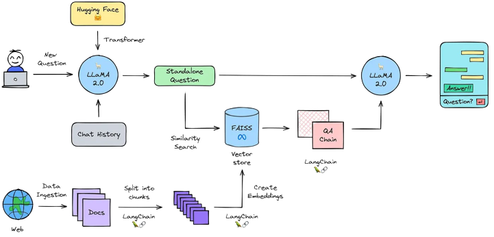

# 🏭 CoalWizard: Mining Industry Chatbot

This repository contains the detailed project we have built for Smart India Hack-a-thon 2023.

Problem statement : `Chatbot to respond to text queries pertaining to various Acts, Rules, and Regulations applicable to Mining industries`

## Table of Contents

- [Introduction](#introduction)
- [Features](#features)
- [Usage](#usage)
  - [Running the Chatbot](#running-the-chatbot)
  - [Text Queries](#text-queries)
  - [Responses](#responses)
- [Customization](#customization)
- [Contributing](#contributing)
- [License](#license)

## Introduction

Welcome to **`CoalWizard`**, your intelligent assistant for all things related to the mining industry. CoalWizard is a powerful chatbot built on the LLMA2 platform, designed to help you access information about various Acts, Rules, and Regulations applicable to the mining sector. Leveraging advanced natural language processing (NLP), CoalWizard provides quick and accurate responses to your mining law queries.

Whether you're a mining professional, researcher, or simply curious about mining regulations, CoalWizard is here to provide detailed information and keep you informed about the legal aspects of the mining industry.

## Features

- **Act and Regulation Lookup**: CoalWizard can retrieve comprehensive information on specific mining Acts, Rules, and Regulations based on your queries.

- **Query Understanding**: The chatbot employs advanced NLP techniques to understand and interpret your mining-related queries effectively.

- **Detailed Responses**: Expect detailed responses that include summaries and key provisions of mining laws and regulations.

- **User-Friendly**: CoalWizard is designed with user-friendliness in mind, ensuring accessibility for users with varying levels of familiarity with mining laws.

- **Customizable**: You can easily customize CoalWizard to include Acts, Rules, and Regulations specific to your region or jurisdiction.

## Usage

### Running the Chatbot

To use CoalWizard, follow these simple steps:

1. Ensure you have Python 3.x installed on your system.

2. Open your terminal or command prompt.

3. Navigate to the directory containing the chatbot's source code.

4. Run the following command:

  ```bash
pip install -r requirements.txt
```

   ```bash
   python app.py
   ```

   CoalWizard will now be up and running, ready to respond to your mining law queries.

### Text Queries

You can interact with CoalWizard by sending text queries. Here are some examples of queries you can use:

- `"Tell me about the Mining Act 2021."`
- `"What are the environmental regulations for mining in India?"`
- `"Explain the key provisions of the Mining Safety Rules."`
- `"What soil types are required for coal mining ?"`

### Responses

CoalWizard will respond to your queries with detailed information about the Acts, Rules, or Regulations you inquire about. You can expect comprehensive responses, including summaries, key provisions, and other relevant details.

### Architecture


## Contributing

We welcome contributions from the community to enhance the functionality and accuracy of CoalWizard. If you would like to contribute, please follow these steps:

1. Fork the repository.

2. Create a new branch for your feature or bug fix.

3. Make your changes and ensure they are well-documented.

4. Submit a pull request with a detailed description of your changes.

## Citation
```
@citation{ 
  CoalWizard,
  author = {Shreyas Dixit},{Omkar Khade},{Atharva Divekar},{Maruf Khan},{Suyash Yeolekar},{Urvi Shah}
  year = {2023},
  hackathon = Smart India Hackathon 2023
}
```
